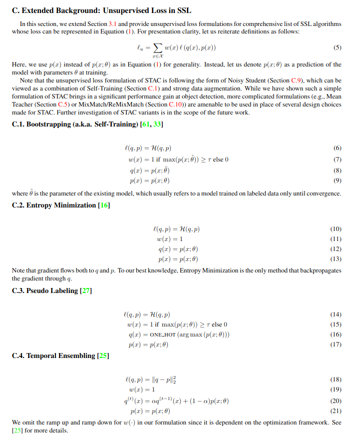
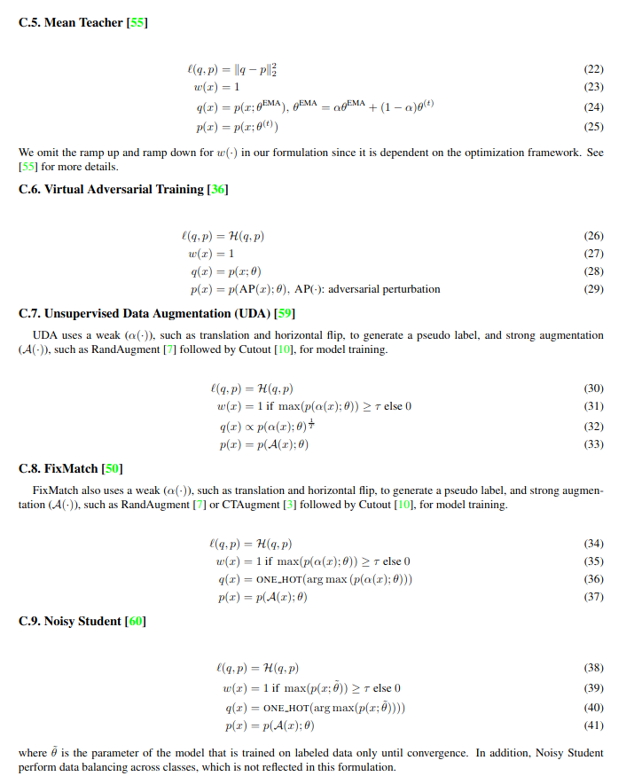
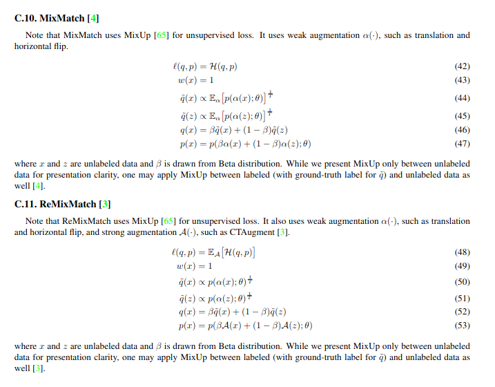

## RoadMap

- [x] Pi-Model
- [x] Entmin
- [x] Self-Training
- [x] Pseudo-Labeling
- [x] Virtual Adversarial Training
- [ ] Temporal Ensembling
- [x] Mean Teacher
- [ ] SimCLR
- [ ] MixMatch
- [ ] FixMatch
- [ ] SimMatch
- [ ] STAC
- [ ] Unbiased Teacher for Object Detection
- [ ] Active Teacher for Object Detection

## PI-Model ([`pi_model.py`](pi_model.py))
```
    for iteration in range(hyperparams.num_iterations):
        model.train()
        
        (x_u, _), (x_l,y_l) = next(train_loader)
        n_u = len(x_u)
        x = torch.cat([x_u, x_l], dim=0)
        x = x.to(cfg.device)
        y_l = y_l.to(cfg.device)

        x1, x2 = augment(x), augment(x)
        out_logits_x1 = model(x1)
         
        with torch.no_grad(): out_logits_x2 = model(x2)
            
        out_probs_x1, out_probs_x2 = F.softmax(out_logits_x1, dim = -1), F.softmax(out_logits_x2, dim = -1) 
            
        supervision_loss = ce_loss(out_logits_x1[n_u:],y_l)

        regularization_loss = mse_loss(out_probs_x1,out_probs_x2)
    
        loss = supervision_loss + regularization_coeff * regularization_loss

        optimizer.zero_grad()
        loss.backward()
        optimizer.step()
```

## Entropy Minimization ([`entmin.py`](entmin.py))
```
    for iteration in range(hyperparams.num_iterations):
        model.train()
        
        (x_u, _), (x_l,y_l) = next(train_loader)
        n_u = len(x_u)
        x = torch.cat([x_u, x_l], dim=0)
        x = x.to(cfg.device)
        y_l = y_l.to(cfg.device)

        x = augment(x)
        out_logits = model(x)
         
        out_probs = F.softmax(out_logits, dim = -1) 
            
        supervision_loss = ce_loss(out_logits[n_u:],y_l)

        regularization_loss = entropy(out_probs)
    
        loss = supervision_loss + regularization_coeff * regularization_loss

        optimizer.zero_grad()
        loss.backward()
        optimizer.step()
```

## Self-Training ([`self_training.py`](self_training.py))
```
    for iteration in range(hyperparams.num_iterations):
        model.train()
        
        (x_u, _), (x_l,y_l) = next(train_loader)
        n_u = len(x_u)
        x = torch.cat([x_u, x_l], dim=0)
        x = x.to(cfg.device)
        y_l = y_l.to(cfg.device)
        
        x1, x2 = augment(x), augment(x)
        
        out_logits_x1 = model(x1)
        with torch.no_grad(): out_logits_x2 = model(x2)
          
        out_probs_x1 = F.softmax(out_logits_x1, dim = -1) 
        out_probs_x2 = F.softmax(out_logits_x1, dim = -1)

        supervision_loss = ce_loss(out_logits_x1[n_u:],y_l, hyperparams.get("label_smoothing",0.0))
        
        confident_predictions_indices = (out_probs_x1[:n_u].amax(dim = -1) > hyperparams.confidence_threshold)
        regularization_loss = kl_div(out_probs_x1[:n_u][confident_predictions_indices], out_probs_x2[:n_u][confident_predictions_indices])

        loss = supervision_loss + regularization_coeff * regularization_loss

        optimizer.zero_grad()
        loss.backward()
        optimizer.step()
```
## Virtual Adversarial Training ([`vat_entmin.py`](vat_entmin.py))
```
    for iteration in range(hyperparams.num_iterations):
        model.train()

        (x_u, _), (x_l,y_l) = next(train_loader)
        n_u = len(x_u)
        x = torch.cat([x_u, x_l], dim=0)
        x = x.to(cfg.device)
        y_l = y_l.to(cfg.device)

        x = augment(x)
        out_logits = model(x)
         
        out_probs = F.softmax(out_logits, dim = -1) 
            
        supervision_loss = ce_loss(out_logits[n_u:],y_l, hyperparams.get("label_smoothing",0.0))
        
        # Compute VAT Loss
        xi, epsilon  = 1e-6, 2
        x_u = x[:n_u].detach()
        adversarial_perturbation = torch.Tensor(x_u.shape).normal_().to(cfg.device)
        adversarial_perturbation = xi * F.normalize(adversarial_perturbation)
        adversarial_perturbation.requires_grad_(True)

        out_perturb = model(x_u + adversarial_perturbation)
        divergence = kl_div(F.softmax(out_perturb, dim = -1), out_probs[:n_u].detach())
        divergence.backward()

        adversarial_perturbation = adversarial_perturbation.grad.data.clone()
        model.zero_grad()
        adversarial_perturbation = epsilon * F.normalize(adversarial_perturbation)
        out_perturb = model(x_u + adversarial_perturbation.detach())
        vat_loss = kl_div(F.softmax(out_perturb, dim = -1), out_probs[:n_u].detach())
        
        entmin_loss = entropy(out_probs[:n_u])
        regularization_loss = vat_loss + entmin_loss 

        loss = supervision_loss + regularization_coeff * regularization_loss

        optimizer.zero_grad()
        loss.backward()
        optimizer.step()
```
## Pseudo-Labeling ([`pseudo_label.py`](pseudo_label.py))
```
    for iteration in range(hyperparams.num_iterations):
        model.train()
        
        (x_u, _), (x_l,y_l) = next(train_loader)
        n_u = len(x_u)
        x = torch.cat([x_u, x_l], dim=0)
        x = x.to(cfg.device)
        y_l = y_l.to(cfg.device)
        
        x1, x2 = augment(x), augment(x)
        
        out_logits_x1 = model(x1)
        with torch.no_grad(): out_logits_x2 = model(x2)
          
        out_probs_x1 = F.softmax(out_logits_x1, dim = -1) 
        out_probs_x2 = F.softmax(out_logits_x1, dim = -1)

        supervision_loss = ce_loss(out_logits_x1[n_u:],y_l, hyperparams.get("label_smoothing",0.0))
        
        confident_predictions_indices = (out_probs_x1[:n_u].amax(dim = -1) > hyperparams.confidence_threshold)
        pseudo_label = out_probs_x2[:n_u][confident_predictions_indices].argmax(-1)
        regularization_loss = ce_loss(out_logits_x1[:n_u][confident_predictions_indices], pseudo_label)

        loss = supervision_loss + regularization_coeff * regularization_loss

        optimizer.zero_grad()
        loss.backward()
        optimizer.step()
```

## Mean-Teacher (`mean_teacher.py`)
```
    for iteration in range(hyperparams.num_iterations):
        model.train()

        if not hyperparams.discard_unlabeled:
        (x_u, _), (x_l,y_l) = next(train_loader)
        n_u = len(x_u)
        x = torch.cat([x_u, x_l], dim=0)
        x = x.to(cfg.device)
        y_l = y_l.to(cfg.device)

        x1, x2 = augment(x), augment(x)
        
        out_logits_x1 = model(x1)
        with torch.no_grad(): out_logits_x2 = ema_model(x2)
            
        out_probs_x1 = F.softmax(out_logits_x1, dim = -1)
        out_probs_x2 = F.softmax(out_logits_x2, dim = -1) 
        
        supervision_loss = ce_loss(out_logits_x1[n_u:],y_l, hyperparams.get("label_smoothing",0.0))
        
        regularization_loss = mse_loss(out_probs_x1,out_probs_x2) 

        loss = supervision_loss + regularization_coeff * regularization_loss

        optimizer.zero_grad()
        loss.backward()
        optimizer.step()

        for ema_param, param in zip(ema_model.parameters(), model.parameters()):
            ema_param.data.mul_(hyperparams.ema_alpha).add_(other=param.data, alpha=1 - hyperparams.ema_alpha)
  ```

## A list curated in STAC https://arxiv.org/pdf/2005.04757



